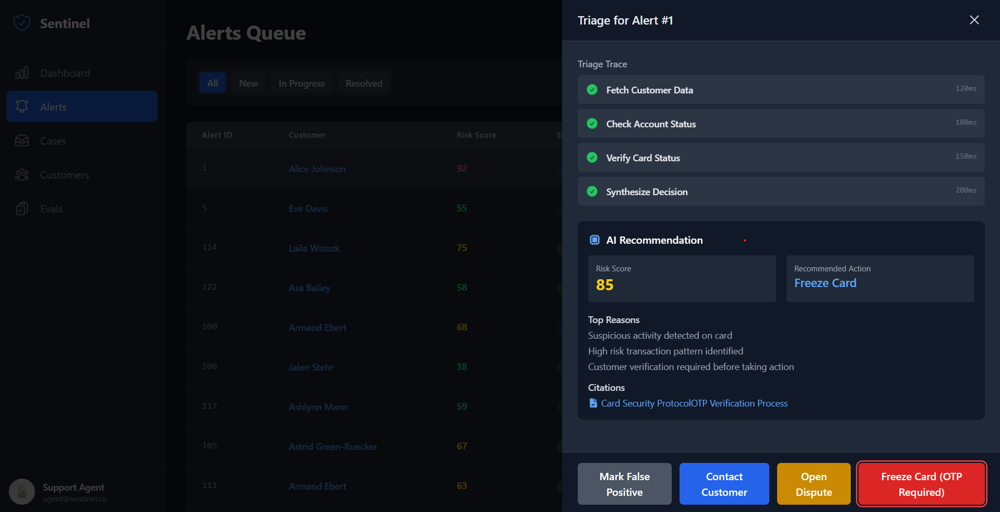

# Sentinel Support

**Simple Transaction Monitoring with a Built-In Knowledge Base**

A lightweight full-stack system for monitoring transactions, freezing suspicious activity, and resolving customer disputes — with a built-in knowledge base for automated support decisions.

---

## Quick Start

### 1️⃣ Install Dependencies

```bash
npm install
```

### 2️⃣ Start the Application

```bash
node index.cjs
```

### 3️⃣ Verify Functionality

* **Health Check:** [http://localhost:3001/health](http://localhost:3001/health)
* **Search Knowledge Base:** [http://localhost:3001/api/kb/search?q=your+query](http://localhost:3001/api/kb/search?q=your+query)

---

## Architecture Overview

```
┌─────────────┐     ┌─────────────┐     ┌─────────────┐
│  Frontend   │     │     API     │     │  SQLite DB  │
│  (React)    │ ◄──►│  (Node.js)  │ ◄──►│  (Local file)│
└─────────────┘     └─────────────┘     └─────────────┘
                         ▲
                         │
                ┌─────────┴─────────┐
                │ Knowledge Articles│
                │      (JSON)       │
                └───────────────────┘
```

**Frontend** — React UI for transaction monitoring, OTP validation, and dispute workflows.
**API Layer** — Node/Express handles business logic, alerting, and KB search endpoints.
**Database** — SQLite (file-based) for simplicity and zero setup.
**Knowledge Base** — Static JSON articles feeding responses for common support actions.

---

## Tech Choices & Trade-offs

| Component                     | Decision            | Rationale                                        |
| ----------------------------- | ------------------- | ------------------------------------------------ |
| **SQLite**                    | Local file DB       | No DB provisioning, fast setup                   |
| **REST API**                  | Node.js + Express   | Familiar, testable, easily containerized         |
| **Simple Search**             | Direct string match | Lightweight; can evolve to full-text later       |
| **React Frontend**            | Vite + React        | Quick SPA development, fast dev server           |
| **Docker Compose (optional)** | Multi-service setup | One command to start all services (API, Web, DB) |

---

## Use Case

Sentinel Support demonstrates:

* Account freeze and OTP validation workflow
* Dispute creation and tracking
* Knowledge base integration for automated resolutions
* API-level rate limiting, fallback handling, and logging

---

## Run in Docker (optional)

If you have a `docker-compose.yml` setup:

```bash
docker compose up --build
```

This will spin up:

* **web** (React app on port 8080)
* **api** (Node service on port 3001)
* **sqlite** (file DB)

Access via [http://localhost:3000](http://localhost:3000)

---

## Demo

Demonstrates OTP freeze flow, dispute handling, fallback, rate limiting, and metrics visibility.




---

## About

**Project:** Sentinel Support

**Purpose:** Full-stack fintech case resolution system with knowledge-driven automation
**Author:** Zaiba Nikhat
